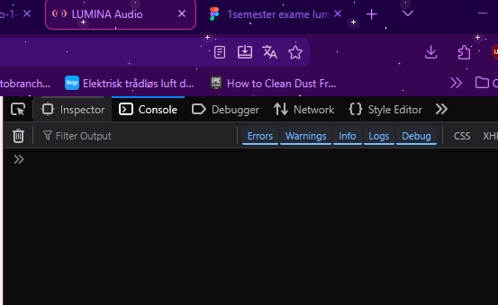

# LUMINA Audio
Lumina audio er en landing page som er en af projekt opgaver vi har arbejdet igennem første semester og jeg har så valgt projektet for at forbedre den med alt det jeg har lært igennem første semeste.

Til projektet har jeg brugt VSC som min kode editer og github for gemningen af min kode og webhosting.

I gennem projektet kan bruge gøre disse interaktioner gennem landing pagen.
* Buttons onclick for at hvis en popup istedet for redirection.
* Projekt farverne af produktet kan ændres til 4 forskellige farver sammen med ændring af billedets vinkel.
* Man kan klikke igennem et galleri med billeder af produktet.

Gennem projektet bruger jeg disse datatyper 
* Sting
* Array
* Object


## Fil- og mappestruktur

### Root files
Så vi kan starte med de filer der er ude i roo folderen der har jeg min index.html hvis jeg havde andre sider jeg skull redirect til ville de filer være i sin egen folder som kunne være kaldt pages. Den anden fil er min json fil der indholder data af mit produkt som indholder tekst, farver og src path. De bliver brugt inde i sectionen, hvor en bruger kan vælge produktets farver men også vinklen af produktet.  

Inde i min index.html fil er den lavet så semanisk, som den kan blive med brug af semantiske elementer såsom article, figure, header osv, som hjælper med SEO (Search Engine Optimization). Noget som også er connected med min css fil er hvordan jeg har skreve class med at gøre at de forsætter med at bygge på sig selv som fx linje 32 med hero section hvor den går fra hero -> hero-content -> hero-content-about jeg syndes selv at det hjælper mere med at få et overblik, men den ene ting jeg var nød til at prøve passe på var længden af class inde i html.

Ellers havde jeg også tænkt at bruge utility class, som er det bootstrap og tailwind bruger for css, hvor en class har en specifik opgave såsom at lave et element som kun gøre flex eller en font større fx.
```
//CSS

.flex-col {
  display: flex;
  flex-direction: column;
}

.gap-16 {
  gap: 16px;
}

.font-lg {
  font-size: 2.4rem;
}


//HTML

<div class="flex-col gap-16">
  <h1 class="font-lg">Title</h1>
  <p>Lorem ipsum dolor, sit amet consectetur adipisicing elit.</p>
</div>
```
Men jeg syndes at ville blive en smule for meget for nu og holdte mig til at lave de classes jeg har nu lavet.
    
### Mappestruktur
Jeg har også valgt at lave folders til både CSS og JS men siden der kun er en fil i hver af dem, kunne det godt have blive fjernet men jeg kan godt lige at have folders, hvis man skulle tilføje en extra fil for en af dem.

Så har jeg en img folder, hvor jeg har prøvet at lave så mange folders som mullight så der ikke ligger 10+ iconer i en folder alene såsom ikonerne var på et tidspunkt. Men med at have flere folders og opdel alt i mindre bider har hjulpet mig med at kunne få et bedre overblik af projektets filer/folder. 


## Validering af HTML, CSS og JS
Som der kan ses er alle tre af mine filer valideret uden at nogen af dem fejlede. 

### Validering af HTML


### Validering af CSS 


### Validering af JS



## JavaScript datastruktur
Min data struktur er hvor jeg har min JSON fil for produktet, hvor den indholder et array of objects som indholder mono strings, som deres type siden jeg bruger dem til at hjælpe mig med at finde den korrkte frave og billeder der skal blive vist ud fra den udvalgte farve af knapperne.


## JS Eksempel 
Så her har jeg et billed af min JS kode, hvor denne del er for galleriet, hvor man kan vælge at gå til næste eller forrige billed hvor den fungere med at udskifte src af billederne. 


