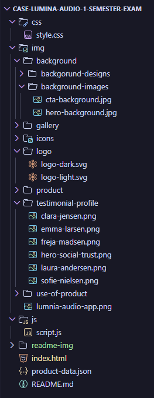
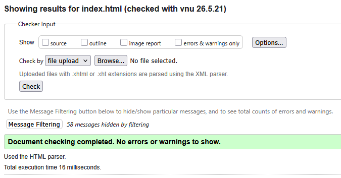
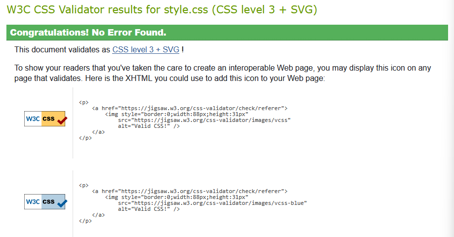
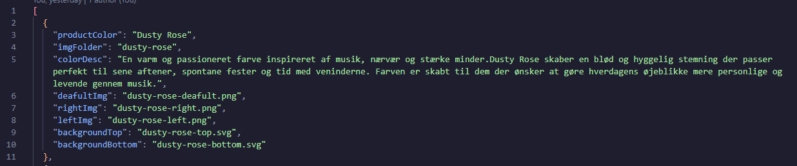
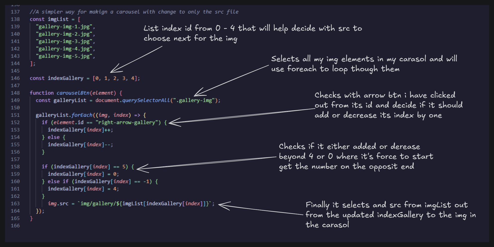

# LUMINA Audio
###### Hvad er formålet med projektet?
Lumina audio er en landing page som er en af projekt opgaver vi har arbejdet igennem første semester og jeg har så valgt projektet for at forbedre den med alt det jeg har lært igennem første semeste.

###### Hvilke teknologier har du brugt?
Jeg har brugt VSC som min kode editer og git for gemme koden op.

###### Hvad kan brugeren gøre på siden?
Projektet er en landing page så den har derfor allerede limited interaktioner.
* Buttons onlcik for at hvis en popup istedet for redirection.
* Projekt farverne af produktet kan ændres til 4 forskellige farver sammen med ændring af billedets vinkel.
* Man kan klikke igennem et galleri med billeder af produktet.

###### Hvilken type data arbejder projektet med?
* Sting
* Array
* Object

## Fil- og mappestruktur
Så vi kan starte med min index.html fil, hvor den indholder symantiske elementer som sections, artikle, osv. hvor hvert sektion er splittet op i en sektion element og bruger onclick for at få funktioner til at blive kaldt fra js siden af  

Jeg har også valgt at lave folders til både CSS og JS men siden der kun er en fil i hver af dem at folderen kunne godt blive fjernet men jeg er vant til at have det samme i folders det samme skulle også gå for pages hvis jeg havde flere mens index skal aldtid være i starten af root folderen

Så har jeg img folder hvor jeg har prøvet at lave så mange folders og smide dem ind i hinandne så der ikke ligger 10+ iconer i en folder men måske 4 i hver folder inde i dem som fx i min icons folder var jeg nød til at lave flere for få et bedre overblik over hvad var pile, funktion iconer og for testimonial

## Validering af HTML, CSS og JS
Som der kan ses er alle tre af mine filer valideret uden nogen ødeliggende fejl

## JavaScript datastruktur
Så for mit data struktur hvor jeg har mit json fil for mit produkt hvor jeg har et array af objecs som indholder strings som deres type siden jeg bruger stringen til at hjælpe find det korrekte billed der bliver valgt sammen med farven

## JS Eksempel 
Så her har jeg et billed af min js kode denne del er for galleriet hvor man kan vælge at gå til næste eller forrige billed hvor den fungere med at udskifte src af billederne 

